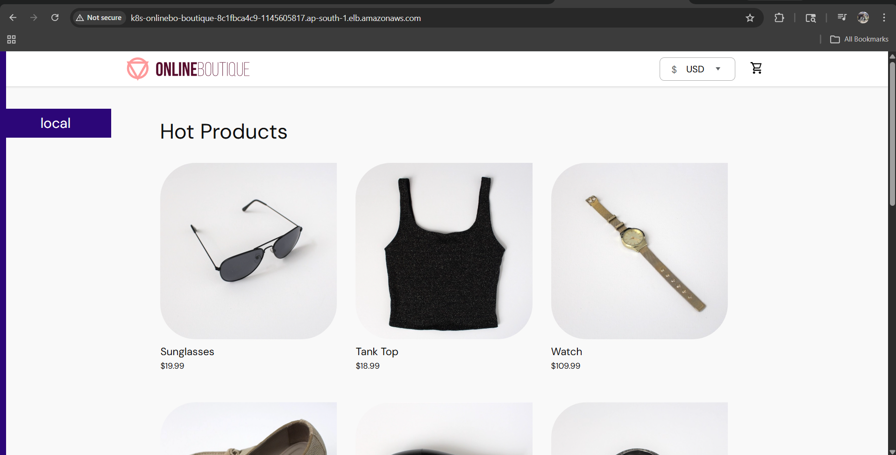
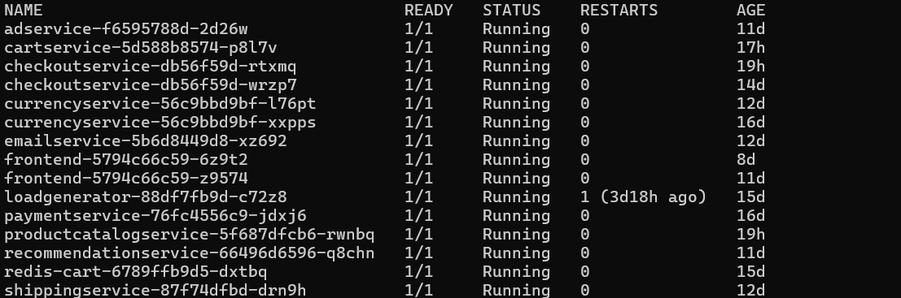
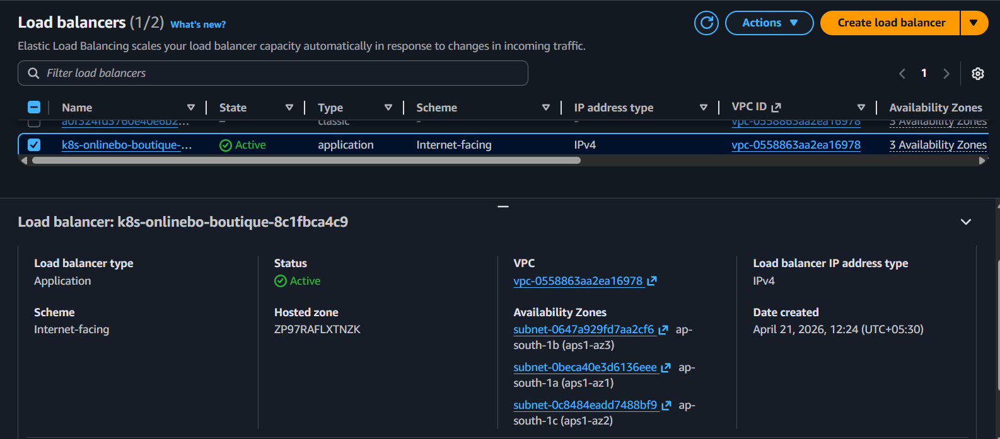
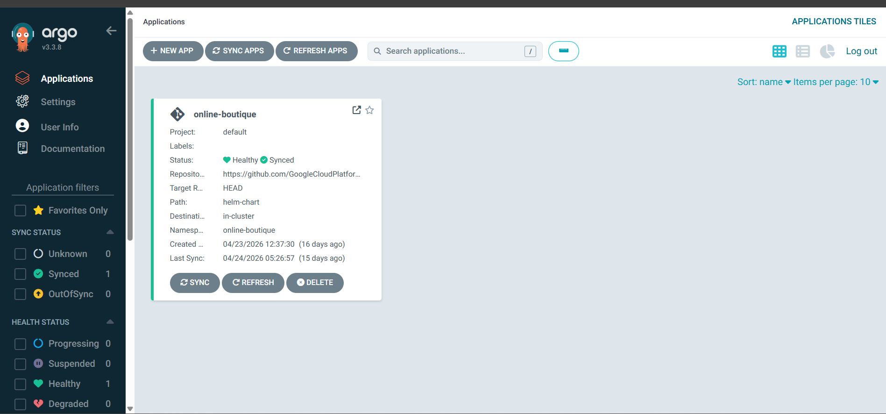
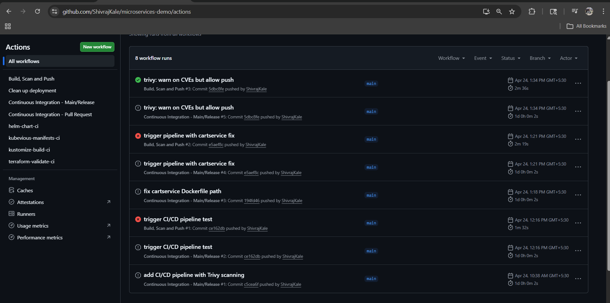
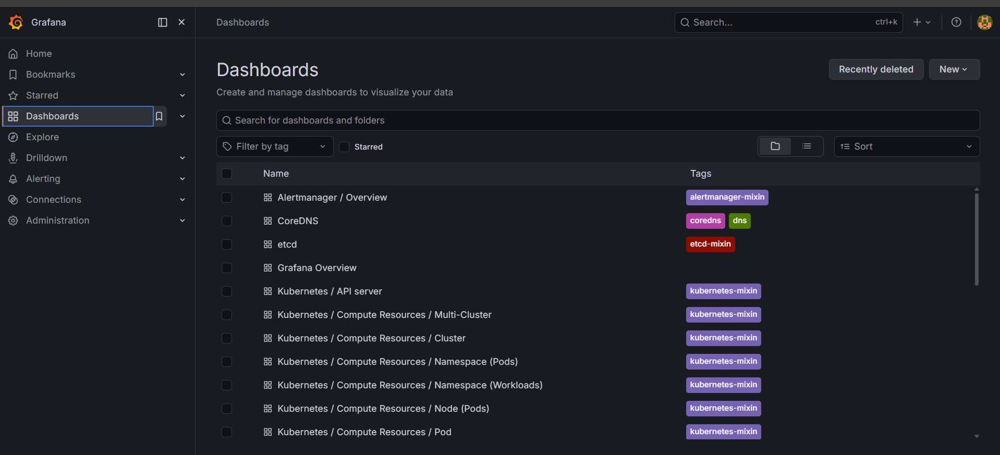

# Production Deployment of Google Online Boutique on AWS EKS

> **11 microservices | 5 languages | Full production infrastructure on AWS — built from scratch**

---

## Overview

Deployed [Google's Online Boutique](https://github.com/GoogleCloudPlatform/microservices-demo) — a cloud-native e-commerce application with **11 microservices written in Go, Python, Node.js, Java, and C#** — on AWS EKS with production-grade infrastructure.

**My Role:** DevOps Engineer. I did not write the application code. I designed, built, and managed all infrastructure, CI/CD, monitoring, and security.

---

## Architecture
'''
Internet → AWS WAF → ALB (3 AZs) → EKS Cluster
├── Frontend (Go)
├── Checkout Service (Go)
├── Cart Service (C#) → Redis
├── Product Catalog (Go)
├── Currency Service (Node.js)
├── Payment Service (Node.js)
├── Shipping Service (Go)
├── Email Service (Python)
├── Recommendation (Python)
├── Ad Service (Java)
└── Load Generator (Python/Locust)
'''
### AWS Infrastructure

| Layer | Service | Details |
|-------|---------|---------|
| Network | VPC + 3-tier subnets | Public, Private, Database across 3 AZs |
| Compute | EKS v1.31 | On-demand + Spot nodes (60-70% savings) |
| Registry | ECR (11 repos) | Private registry with CVE scanning |
| Load Balancing | ALB | Auto-provisioned by ALB Controller |
| Security | WAF + Network Policies | Edge firewall + zero-trust pod isolation |
| Secrets | Secrets Manager + ESO | Encrypted, auto-synced into K8s |
| GitOps | ArgoCD | Git = single source of truth |
| CI/CD | GitHub Actions | Parallel builds + Trivy scanning |
| Monitoring | Prometheus + Grafana | Metrics, dashboards, alert rules |
| Scaling | HPA + PDB | Auto-scaling + zero-downtime maintenance |

---

## Repository Structure
'''
online-boutique-devops-project/
├── terraform/                          # Infrastructure as Code
│   ├── backend.tf                      # S3 remote state + DynamoDB lock
│   ├── vpc.tf                          # 3-tier VPC, NAT GW, Flow Logs
│   └── eks.tf                          # EKS cluster, node groups, IRSA
│
├── kubernetes/
│   ├── helm/
│   │   ├── values-prod.yaml            # ECR image overrides, replicas
│   │   └── ingress.yaml                # ALB Ingress configuration
│   ├── argocd/
│   │   └── argocd-app.yaml             # ArgoCD Application definition
│   ├── security/
│   │   ├── network-policies.yaml       # Zero-trust pod communication
│   │   ├── cluster-secret-store.yaml   # AWS Secrets Manager integration
│   │   └── external-secret.yaml        # Secret sync configuration
│   ├── scaling/
│   │   ├── hpa.yaml                    # Horizontal Pod Autoscalers
│   │   └── pdb.yaml                    # PodDisruptionBudgets
│   └── monitoring/
│       └── boutique-alerts.yaml        # Prometheus alert rules
│
├── cicd/
│   └── build-deploy.yaml              # GitHub Actions CI/CD pipeline
│
├── docs/
│   └── RUNBOOK.md                      # Operations runbook
│
├── screenshots/                        # Visual proof of deployment
│   ├── 01-app-homepage.png
│   ├── 04-kubectl-pods-running.png
│   ├── 07-alb-active.png
│   ├── 08-argocd-dashboard.png
│   ├── 09-github-actions-green.png
│   ├── 11-grafana-dashboard.png
│   └── 14-hpa-output.png
│
└── README.md
'''
---

## What I Built — 10 Phases

### Phase 1: Tools & AWS Account Setup
- Dedicated EC2 bastion server for all infrastructure work
- Terraform remote state with S3 + DynamoDB locking
- Two-repo strategy: infrastructure (Terraform) + app deployment (GitOps)

### Phase 2: Production VPC (Terraform)
- 3-tier VPC: public (ALB), private (EKS nodes), database (Redis)
- NAT Gateway per AZ for high availability
- VPC Flow Logs for security auditing
- Subnet tags for EKS/ALB auto-discovery

### Phase 3: EKS Cluster
- Private API endpoint restricted to my IP
- On-demand system nodes + Spot app nodes (60-70% cheaper)
- OIDC/IRSA for pod-level IAM roles
- EBS CSI driver with IRSA (separate resource to avoid circular dependency)

### Phase 4: ECR & Helm Deploy
- 11 ECR repositories with scan-on-push
- Built ALL Docker images from source code
- Deployed via Helm with environment-specific values

### Phase 5: ALB Ingress
- AWS Load Balancer Controller with IRSA
- cert-manager for automatic TLS
- Internet-facing ALB auto-provisioned from Kubernetes Ingress

### Phase 6: Security Hardening
- External Secrets Operator → AWS Secrets Manager
- Network Policies: default deny-all + explicit allow rules
- AWS WAF: SQL injection + XSS protection

### Phase 7: GitOps with ArgoCD
- Automated sync, self-heal, prune
- Every deployment = a Git commit with audit trail
- Rollback = revert a Git commit

### Phase 8: CI/CD Pipeline
- GitHub Actions with matrix strategy (10 parallel builds)
- Trivy CVE scanning on every image
- Images tagged with Git commit SHA for traceability

### Phase 9: Monitoring
- Prometheus + Grafana + Alertmanager (kube-prometheus-stack)
- Custom alerts: PodCrashLooping, DeploymentDown, HighMemoryUsage

### Phase 10: Scaling & Reliability
- HPA on frontend (60%), checkout (50%), currency (40%)
- PDB: minAvailable=1 on critical services
- k6 load testing to validate auto-scaling

---

## Problems I Solved

| Problem | Solution |
|---------|----------|
| EBS CSI driver circular dependency in Terraform | Extracted addon as separate resource with `depends_on` |
| Disk space exhaustion during Docker builds (8GB default) | Expanded EBS to 50GB, added `docker image prune` after each push |
| ALB subnet tag mismatch (wrong cluster name) | Fixed tags with AWS CLI, updated vpc.tf to prevent drift |
| ALB controller missing IAM permission | Added inline policy with `DescribeListenerAttributes` |
| Trivy blocking image push (upstream CVEs) | Changed to warn mode since code is upstream/not owned |
| Prometheus PVC stuck in Pending | Reinstalled with in-memory storage (legacy StorageClass issue) |
| GitHub Actions credentials not found | Added AWS secrets to repo settings (secrets don't copy on fork) |
| ArgoCD CLI crashing port-forward | Used declarative YAML with kubectl instead of CLI |
| Cartservice Dockerfile in non-standard path | Added if condition in CI/CD for `src/cartservice/src/` |

---

## Tools & Technologies

| Category | Tools |
|----------|-------|
| IaC | Terraform, AWS VPC/EKS/ECR modules |
| Orchestration | AWS EKS (Kubernetes 1.31) |
| Containers | Docker, ECR, Helm |
| GitOps | ArgoCD |
| CI/CD | GitHub Actions, Trivy |
| Monitoring | Prometheus, Grafana, Alertmanager |
| Security | AWS WAF, Network Policies, External Secrets Operator, IRSA |
| Load Testing | k6 |

---

## Screenshots

### Application Running

### All Pods Running

### ALB Active

### ArgoCD Dashboard

### CI/CD Pipeline

### Grafana Monitoring

---
